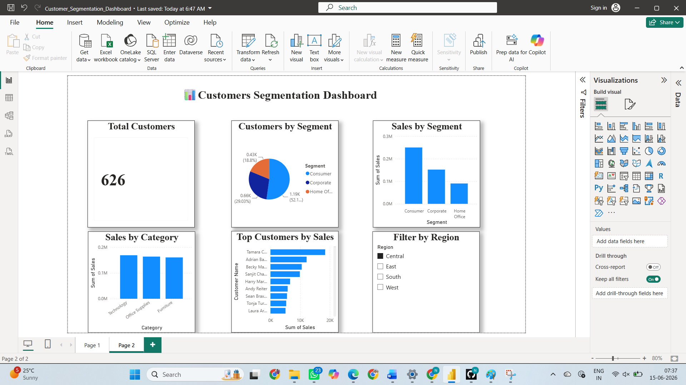

# customer-segmentation-dashboard
A Power BI dashboard project focused on customer segmentation and sales analysis. It provides insights into customer distribution, sales performance by segment and category, top customers, and region-wise filtering for business decision-making.

## Project Overview

This project analyzes customer behavior and sales performance using Power BI.

### Features

- Total Customers Analysis
- Customer Segmentation
- Sales by Segment
- Sales by Category
- Top Customers by Sales
- Region Filter

## Dashboard Preview

## Tools Used

- Power BI
- Superstore Sales Dataset

## Author

B. Satyanarayana
